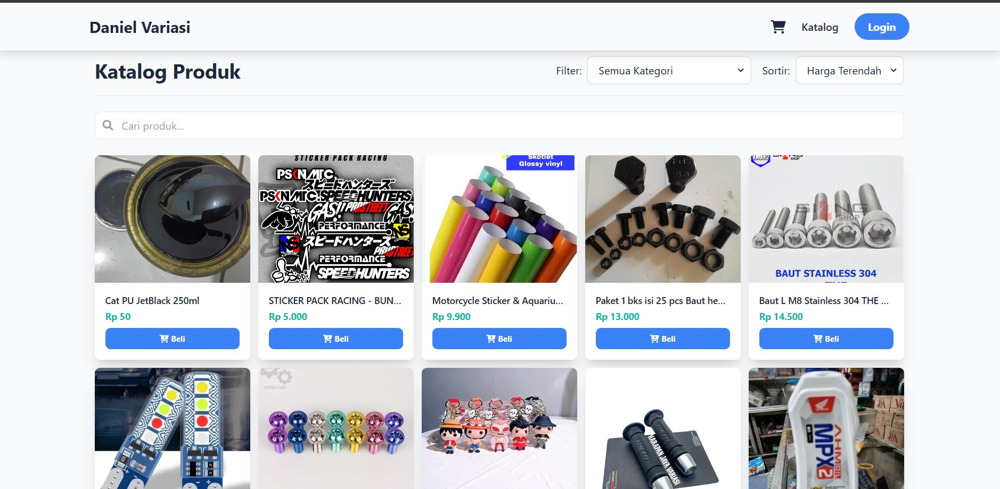
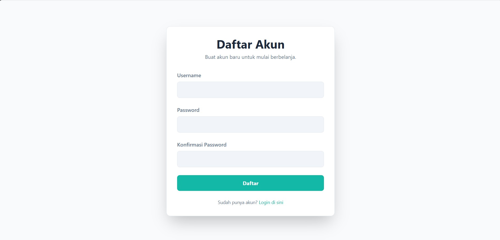
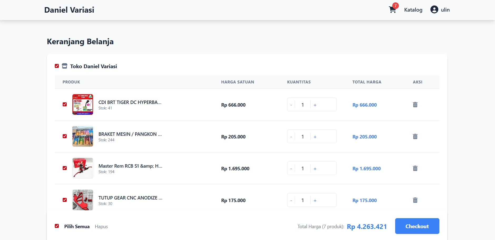
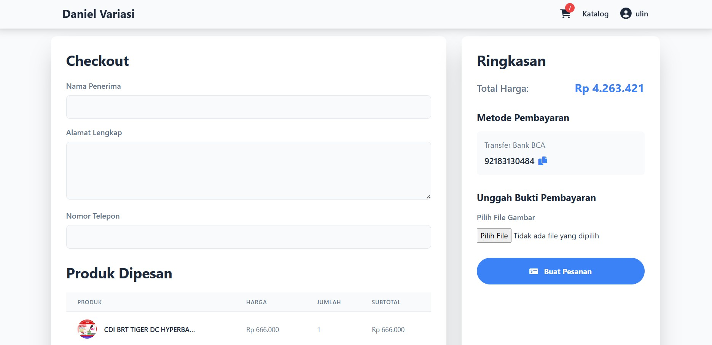
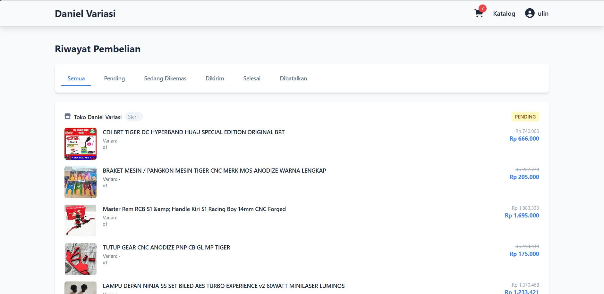
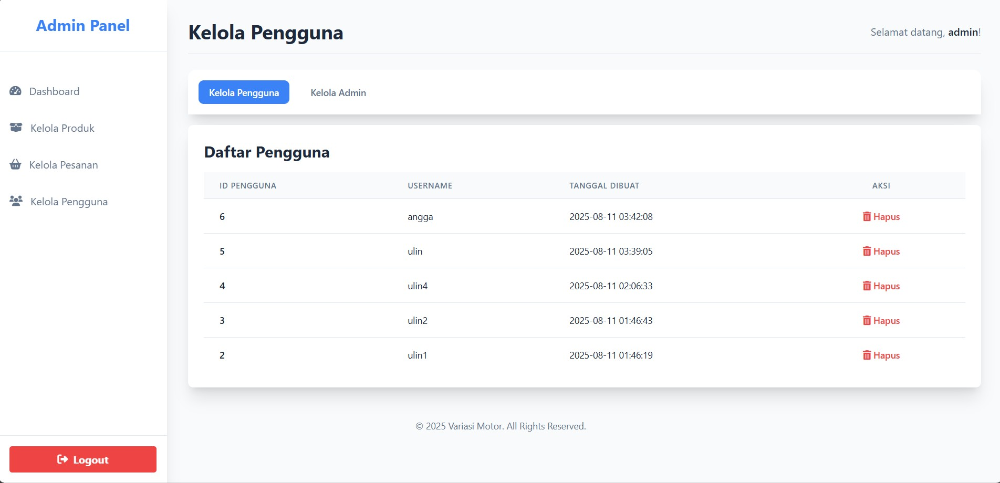
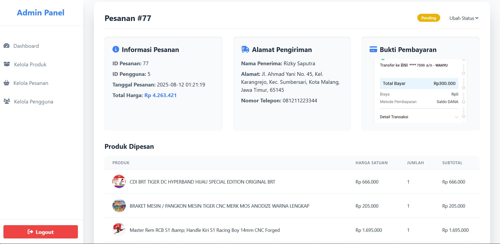
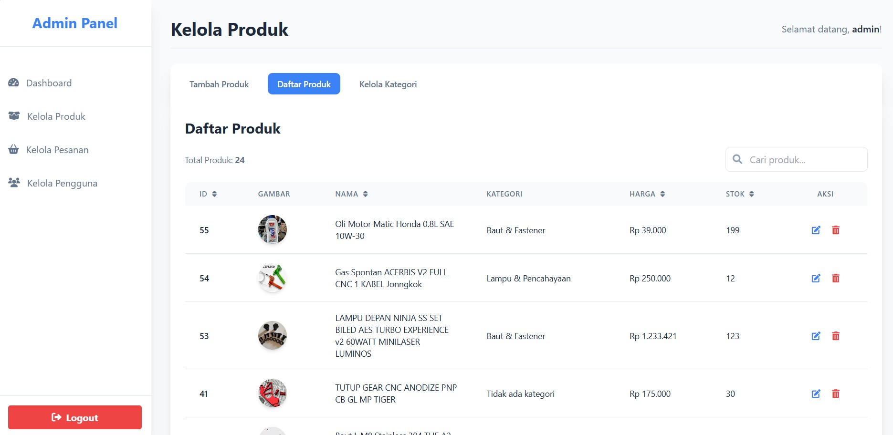
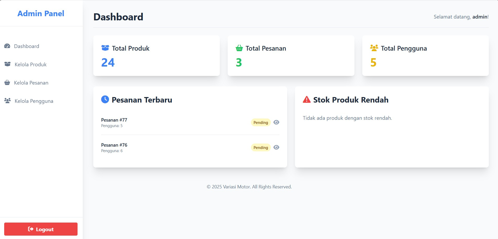

# Daniel Variasi

Aplikasi e-commerce sederhana untuk penjualan variasi dan suku cadang motor.  
Dibangun menggunakan **PHP** dengan arsitektur **Model-View-Controller (MVC)** sederhana.

## ✨ Fitur Utama

### Untuk Pengguna
- **Beranda** – Banner promosi & produk terbaru.
- **Katalog Produk** – Filter & urutkan produk berdasarkan kategori atau harga.
- **Detail Produk** – Lihat deskripsi, harga, stok, dan gambar.
- **Keranjang Belanja** – Tambah, hapus, atau ubah jumlah produk.
- **Checkout** – Isi data pengiriman & unggah bukti pembayaran.
- **Login & Registrasi** – Sistem autentikasi dengan password hash.
- **Riwayat Pesanan** – Lihat status pesanan (Pending, Dikemas, Dikirim, Selesai, Dibatalkan).

### Untuk Admin
- **Login Admin** – Akses terpisah dari user biasa.
- **Dashboard** – Statistik toko & ringkasan aktivitas.
- **Kelola Produk** – CRUD produk (nama, deskripsi, harga, stok, gambar, kategori).
- **Kelola Kategori** – Tambah, edit, hapus kategori produk.
- **Kelola Pesanan** – Update status pesanan.
- **Kelola Pengguna** – Lihat & hapus akun user/admin.

## 🛠️ Teknologi
- **Backend:** PHP Native
- **Database:** MySQL
- **Frontend:** Tailwind CSS
- **Routing:** `.htaccess`
- **Arsitektur:** MVC sederhana

## 📸 Screenshot

